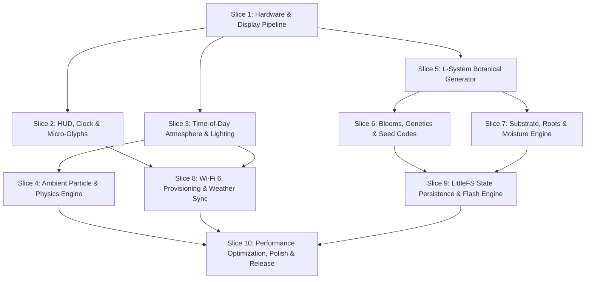

# Deskflower: 10-Slice Implementation Plan

**Target Platform:** ESP32-C6 (RISC-V @ 160MHz)  
**Display:** 172×320 IPS LCD (ST7789 Controller)  
**Framework:** ESP-IDF / Arduino-ESP32 with LovyanGFX / TFT_eSPI  
**Storage & Sync:** LittleFS + Wi-Fi 6 (802.11ax) + SNTP / Open-Meteo  

---

## Architecture Overview & Dependency Flow

---

## Slice 1: Hardware Bringup & Display Pipeline
* **Goal:** Initialize ESP32-C6 peripherals, establish high-speed SPI display communication, and achieve a stutter-free double-buffered rendering pipeline.
* **Key Deliverables:**
  1. Pin mapping and peripheral initialization (ST7789 SPI bus, backlight PWM, Boot button GPIO, WS2812 RGB LED GPIO).
  2. Display driver configuration (172×320 resolution, 16-bit RGB565 color format, DMA-enabled SPI transfer).
  3. Framebuffer architecture: Split-canvas / DMA double-buffered draw pipeline targeting 30–60 FPS.
  4. Core system heartbeat loop and frame-time diagnostic readout.
* **Verification & Acceptance Criteria:**
  * Clean boot with zero display artifacts, tearing, or SPI bus panics.
  * Render test suite maintaining stable 60 FPS while reporting heap and SRAM overhead (< 40 KB initial footprint).

---

## Slice 2: Minimalist HUD, Real-Time Clock & Micro-Weather Glyphs
* **Goal:** Implement the top 24px HUD status bar featuring real-time timekeeping and dynamic micro-weather indicators.
* **Key Deliverables:**
  1. Dedicated 172×24 HUD off-screen sprite buffer with smooth alpha-blended background overlay.
  2. Clean typographic micro-font renderer for 12h/24h time with gentle pulsing colon animation.
  3. 8×8 / 10×10 monochrome and 2-bit color micro-glyph bitmap library:
     * ☀️ Clear Sun, ⛅ Partly Cloudy, ☁️ Overcast, 🌧️ Rain/Mist, 🌙 Clear Night.
  4. Minimalist layout formatting: `[ HH:MM AM/PM | ☀️ 72°F 64% | GEN 01 ]`.
* **Verification & Acceptance Criteria:**
  * Time updates precisely on the second without causing stutter or redraw flashes in the lower viewport.
  * Micro-icons render cleanly with crisp sub-pixel clarity at 172px width.

---

## Slice 3: Dynamic Time-of-Day Atmospheric Engine
* **Goal:** Build the diurnal atmospheric engine that transforms color palettes, sky gradients, and ambient LED lighting based on the local time of day.
* **Key Deliverables:**
  1. 5-Phase Diurnal Cycle State Machine:
     * **Dawn (05:30 – 08:00):** Pastel peach to lavender vertical gradient.
     * **Daylight (08:00 – 17:30):** Crisp sky blue to radiant pale azure.
     * **Golden Hour (17:30 – 19:30):** Warm honey amber wash with elongated shadows.
     * **Dusk (19:30 – 21:30):** Deep violet into twilight indigo.
     * **Night (21:30 – 05:30):** Obsidian navy backdrop with dimmed contrast.
  2. Smooth sine-eased RGB color interpolation across phase boundaries.
  3. Onboard addressable RGB LED driver mapped to active time phases (warm daylight, amber dusk, bioluminescent night glow).
* **Verification & Acceptance Criteria:**
  * Seamless color transitions between phases with zero hard step-banding.
  * Ambient RGB LED smoothly mirrors screen color temperature at low, non-distracting lumens.

---

## Slice 4: Ambient Particle & Physics System
* **Goal:** Implement an efficient 2D particle simulation engine for atmospheric and interaction effects.
* **Key Deliverables:**
  1. Lightweight fixed-array particle pool (max 48 active particles to preserve SRAM).
  2. Atmospheric particle behaviors:
     * **Daytime:** Floating photosynthetic oxygen bubbles rising from leaf positions.
     * **Night:** Drifting bioluminescent fireflies and twinkling star motes.
     * **Rain/Humidity:** Condensation mist droplets accumulating and sliding down simulated glass.
  3. Interaction particles: Soft raindrop cascade triggered upon manual watering.
* **Verification & Acceptance Criteria:**
  * Particle updates run within double-buffered rendering pipeline with < 1.5ms compute time per frame.
  * No dynamic memory allocations (`malloc`/`free`) during active particle lifecycles.

---

## Slice 5: L-System Procedural Botanical Growth Engine
* **Goal:** Develop the procedural generative plant architecture that creates unique fractal stem structures and organic swaying animations.
* **Key Deliverables:**
  1. String-rewriting L-System engine customized for compact botanical rule sets.
  2. Growth node hierarchy (internodes, branching angles, thickness tapering, leaf attachments).
  3. Harmonic swaying algorithm: Multi-frequency sine wave displacement applying subtle motion to stems based on height and ambient air currents.
  4. Vector-to-raster branch renderer using anti-aliased thick lines and tapered polygon fills.
* **Verification & Acceptance Criteria:**
  * Generates completely distinct, aesthetically pleasing branching trees from different seed values.
  * Continuous organic wind sway runs smoothly at 45+ FPS with zero jitter.

---

## Slice 6: Blooming, Morphologies & Genetics Engine
* **Goal:** Implement flower bud blooming, diverse botanical phenotypes, cross-pollination physics, and the 16-character Seed Code system.
* **Key Deliverables:**
  1. Flower blossoming lifecycle (closed bud ➔ swollen calyx ➔ unfurled bloom ➔ mature nectar stage).
  2. Botanical phenotype variations: Mosses, dwarf ferns, highland orchids, and micro-succulents.
  3. Diurnal petal posture logic (blooms open during daylight/golden hour, close at dusk/night).
  4. Cross-pollination mechanics: Floating pollen motes fertilizing mature flowers to spawn seed pods into soil.
  5. **16-Character Seed Code Engine:** Base32 encoding/decoding of plant genome (branching depth, curvature, petal hue, leaf shape, mutation rates).
* **Verification & Acceptance Criteria:**
  * Seed codes consistently reproduce the exact botanical specimen across different devices.
  * Flower unfolding animation plays smoothly across simulated growth phases.

---

## Slice 7: Substrate Strata, Root Dynamics & Asymmetric Moisture Model
* **Goal:** Create the bottom 40px substrate layer, root cross-section visualization, and the anti-annoyance moisture simulation.
* **Key Deliverables:**
  1. Substrate rendering: Organic soil strata texture with procedural subterranean branching roots mirroring stem growth.
  2. Embedded minimalist moisture indicator integrated directly into the soil line.
  3. Asymmetric Moisture State Machine:
     * Dynamic equilibrium baseline: 40% – 60%.
     * Boot button click handler: +20% moisture boost + raindrop cascade.
     * 15-minute diminishing returns cooldown timer.
     * 04:00 AM local time autonomic dew cycle recovery.
  4. **Aestivation (Dormancy Mode):** Safe dormancy trigger when moisture drops below 20% (petals fold, leaves take on muted pastel antique tint; one click revives instantly).
* **Verification & Acceptance Criteria:**
  * Plants never perish or display broken/ugly visual states under zero interaction.
  * Single button click immediately triggers smooth watering feedback and LED cyan breathing pulse.

---

## Slice 8: Wi-Fi 6 Networking, Captive Portal & Weather API Sync
* **Goal:** Integrate non-blocking Wi-Fi 6 connectivity, frictionless onboarding, and real-time weather data synchronization.
* **Key Deliverables:**
  1. Zero-friction captive portal onboarding (`WiFiManager` / ESP-IDF SoftAP portal) for entering SSID/password and location coordinates.
  2. SNTP network time client maintaining synchronized local time and timezone offsets.
  3. Asynchronous HTTPS client polling Open-Meteo / OpenWeatherMap APIs every 30 minutes:
     * Extracts temperature, humidity, precipitation, and cloud cover.
     * Updates top HUD micro-glyph and modulates plant growth speed accordingly.
  4. Robust offline failover: Graceful degradation to simulated local diurnal cycles if Wi-Fi disconnects.
* **Verification & Acceptance Criteria:**
  * Wi-Fi provisioning completes on mobile phone/browser in < 60 seconds.
  * HTTPS weather fetch runs asynchronously in a dedicated FreeRTOS task without blocking the 60 FPS graphics loop.

---

## Slice 9: State Persistence & LittleFS Flash Architecture
* **Goal:** Implement persistent storage to preserve plant lineage, age, mutations, and settings across power-loss events.
* **Key Deliverables:**
  1. LittleFS partition configuration on ESP32-C6 flash memory (< 64 KB allocated).
  2. Binary state serializer/deserializer:
     * Current plant genome, growth stage, generation index (`GEN XX`), hydration metrics, and lifetime statistics.
     * Wi-Fi credentials and UI preferences (12h/24h time, °F/°C units).
  3. Flash wear-leveling strategy: Debounced state writes occurring only on significant lifecycle milestones or safe intervals.
* **Verification & Acceptance Criteria:**
  * Full plant state instantly restored within 800ms of boot after hard power unplug.
  * Zero flash corruption under abrupt power-cut tests.

---

## Slice 10: Performance Optimization, Polish & Release Packaging
* **Goal:** Finalize graphics optimizations, memory budgeting, power management, and firmware distribution packaging.
* **Key Deliverables:**
  1. Memory and CPU profiling: Guarantee total SRAM utilization stays under 120 KB and CPU load remains below 65%.
  2. Night mode dynamic brightness throttling: Reduces backlight PWM between 23:00 and 06:00 for comfortable dark-room aesthetics.
  3. Seed Code Export / Import menu via single/double Boot button click patterns.
  4. Factory firmware binary builds, flashing documentation, and open-source release readiness.
* **Verification & Acceptance Criteria:**
  * Stable 24/7 continuous operation without memory leaks, heap fragmentation, or thermal throttling.
  * Deskflower provides an enchanting, zero-maintenance, aesthetically calming workstation companion.

---

## Appendix: Verified Hardware Architecture & Lessons Learned (Waveshare ESP32-C6-LCD-1.47)

### 1. Pin Configuration
| Signal | GPIO | Function / Notes |
| :--- | :--- | :--- |
| `PIN_LCD_MOSI` | **GPIO 6** | Hardware SPI MOSI (SDA) |
| `PIN_LCD_SCLK` | **GPIO 7** | Hardware SPI SCLK (SCL) |
| `PIN_LCD_CS` | **GPIO 14** | LCD Chip Select |
| `PIN_LCD_DC` | **GPIO 15** | LCD Data / Command |
| `PIN_LCD_RST` | **GPIO 21** | LCD Hardware Reset |
| `PIN_LCD_BL` | **GPIO 22** | Backlight Control (Active HIGH) |
| `PIN_SD_CS` | **GPIO 4** | **Shared SPI Bus Isolation:** Must be set to `OUTPUT` and held `HIGH` on boot |
| `PIN_RGB_LED` | **GPIO 8** | Onboard WS2812 Addressable RGB LED |
| `PIN_BOOT_BUTTON` | **GPIO 9** | Onboard Boot / User Interaction Button (Active LOW) |

### 2. Display Driver & Geometry
* **Driver:** `Arduino_GFX_Library` using `Arduino_HWSPI` and `Arduino_ST7789`.
* **Geometry:** Width = `172`, Height = `320`, Column Offset = `34`, Row Offset = `0`, IPS Inversion = `true`.
* **Stack Size:** Arduino `loopTask` stack must be expanded (`getArduinoLoopTaskStackSize() -> 32768`) to prevent stack protection faults on RISC-V.
* **Arduino CLI Prototype Protection:** Explicit `void setup();` and `void loop();` prototypes must be declared in `.ino` to prevent `arduino-ctags` from injecting recursive call artifacts into `setup()`.
